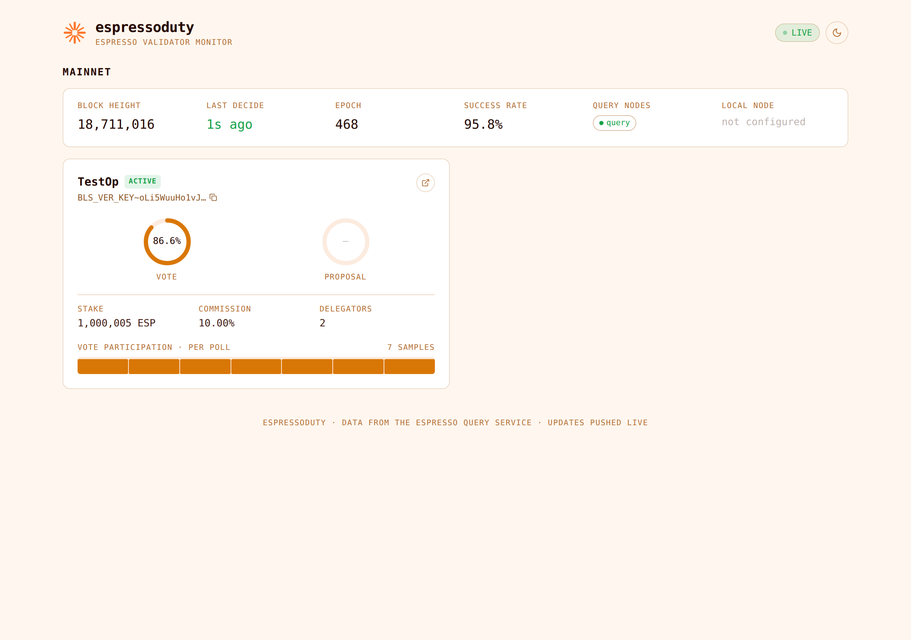
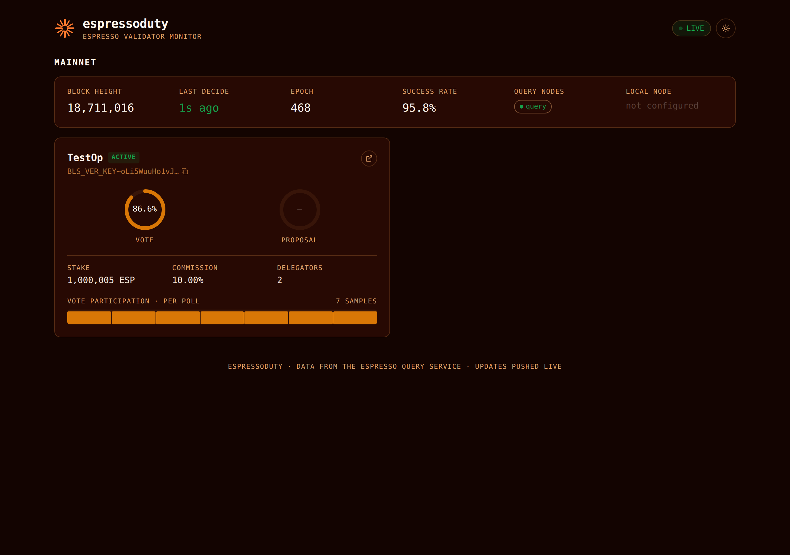

# espressoduty

[](LICENSE)


Uptime monitoring and alerting for [Espresso Network](https://espressosys.com/) validators.
Watches your validators' vote and proposal participation, catches chain stalls,
set drops and delegation changes, and pages you over Telegram, Discord, Slack or
PagerDuty. Ships with a live dashboard on port 3030 that updates over
server-sent events — no refresh interval, no page reloads.

No node required: everything works against the public query service. Point it
at your own node and it additionally checks reachability and sync lag.



<details>
<summary>dark theme</summary>



</details>

## How Espresso is different

Chains like Monad or Cosmos expose a per-block signed/missed stream, so
monitors count individual misses. Espresso does not: HotShot participation is
published as a **per-epoch rate** (`0.0–1.0`) for votes and for proposals. A
node that dies mid-epoch drags the average down slowly, which delays naive
threshold alerts. espressoduty compensates:

- **Absolute thresholds** on the vote rate (`warn` / `critical`) and the
  proposal rate.
- **Trend detection**: the rate is sampled every poll; a drop of more than
  `TREND_DROP` between consecutive samples means the node is missing views
  *right now*, and fires a warning while the average still looks fine.
- **Epoch rollover handling**: rates reset each epoch, and one missed view in
  a young epoch reads as a catastrophic rate. Absolute alerts are suppressed
  for `EPOCH_MIN_SAMPLE_MIN` minutes after a rollover; the finished epoch's
  final rates are snapshotted into the history table and an epoch summary is
  sent.

Every alert has a matching recovery message (with the lowest rate and duration
of the incident), repeated alerts respect a cooldown, and nothing ever fires
on the first poll after a restart.

## Quick start

```bash
git clone https://github.com/s0urledd/espressoduty.git
cd espressoduty
cp .env.example .env   # add your BLS key(s) and alert channels
npm install
npm run build
```

Run with PM2 (recommended):

```bash
npm install -g pm2
pm2 start ecosystem.config.js
pm2 logs espressoduty
```

Or with Docker:

```bash
docker compose up -d --build
```

The dashboard is at `http://localhost:3030`. Send a test alert with:

```bash
curl -X POST http://localhost:3030/api/alert
```

## Configuration

Everything is configured through `.env` (see [.env.example](.env.example) for
the full commented list).

| Variable | Default | Purpose |
|---|---|---|
| `MAINNET_VALIDATORS` | — | Comma-separated BLS keys. `Label=BLS_VER_KEY~...` attaches a display name |
| `MAINNET_QUERY_NODES` | public query node | First is primary, the rest are automatic failover |
| `TESTNET_VALIDATORS` / `TESTNET_QUERY_NODES` | — | Same, for the Decaf testnet |
| `LOCAL_NODE_URL` | — | Your node's query service; enables local-down and sync-lag checks |
| `VOTE_WARN` / `VOTE_CRITICAL` | `0.90` / `0.50` | Vote participation thresholds |
| `PROPOSAL_WARN` | `0.80` | Proposal participation threshold |
| `TREND_DROP` | `0.05` | Consecutive-poll drop that fires the early trend warning |
| `DECIDE_STALL_SEC` | `60` | Seconds without a decide before the chain counts as stalled |
| `HEIGHT_LAG_BLOCKS` | `20` | Local-node lag tolerance |
| `EPOCH_MIN_SAMPLE_MIN` | `10` | Alert suppression window after an epoch rollover |
| `ALERT_COOLDOWN_MIN` | `30` | Minimum minutes between repeats of the same alert |
| `POLL_INTERVAL_SEC` | `60` | Participation poll interval |
| `STATUS_POLL_INTERVAL_SEC` | `10` | Fast status poll driving the live dashboard and stall detection |
| `QUERY_HEALTH_ALERTS` | `off` | `on` adds endpoint offline/stale/failover/all-offline alerts |
| `TELEGRAM_BOT_TOKEN` + `TELEGRAM_CHAT_ID` | — | Telegram channel |
| `DISCORD_WEBHOOK_URL` / `SLACK_WEBHOOK_URL` | — | Webhook channels |
| `PAGERDUTY_ROUTING_KEY` + `PAGERDUTY_THRESHOLD` | — / `3` | Page after N consecutive critical polls |

## Alerts

| Alert | Severity | Recovery |
|---|---|---|
| Vote participation below `VOTE_CRITICAL` | critical (pages after `PAGERDUTY_THRESHOLD` polls) | yes, with incident low + duration |
| Vote participation below `VOTE_WARN` | warning | yes |
| Participation dropping mid-epoch (trend) | warning | — (one per epoch) |
| Proposal participation below `PROPOSAL_WARN` | warning | yes |
| Validator missing from the participation map | critical | yes |
| No decide for `DECIDE_STALL_SEC` (cross-checked against other endpoints) | critical, or warning if only the endpoint is stale | yes |
| Delegation / stake changed | info | — |
| Epoch summary with final rates | info | — |
| Query endpoint offline / stale height / failover / all offline (opt-in) | warning–critical | yes |
| Local node unreachable / falling behind | critical / warning | yes |
| Monitor start / shutdown | info | — |

Before alerting that the network is down, espressoduty cross-checks chain
progress through the other configured endpoints (and your local node, if any),
so an alert about *your* endpoint being rate-limited doesn't masquerade as a
chain halt.

## Dashboard

One page, dark and light themes, pushed live over SSE:

- a card per watched validator: vote and proposal gauges colored by your
  thresholds, active/inactive/missing badge, stake, commission, delegator
  count, and a poll-sampled participation timeline with epoch boundaries
  marked (Espresso has no per-block miss events, so the timeline shows real
  samples instead of pretending otherwise);
- a network strip: block height, time since last decide, current epoch,
  success rate, query-endpoint health pills, local node state;
- an epoch history table with final vote/proposal rates per epoch.

State lives in memory. A restart starts clean, which is also why the first
poll never alerts.

## Data sources

Everything comes from the Espresso query service (`/v1`):

- `node/participation/vote/{current,epoch}` and
  `node/participation/proposal/{current,epoch}` — participation rates
- `node/stake-table/current` — current epoch number, set membership, stake
- `node/validators/:epoch`, `node/all-validators/...` — identity, commission,
  delegators; used to tell "dropped from the set" from "wrong key"
- `status/block-height`, `status/time-since-last-decide`,
  `status/success-rate` — liveness

MIT licensed.
